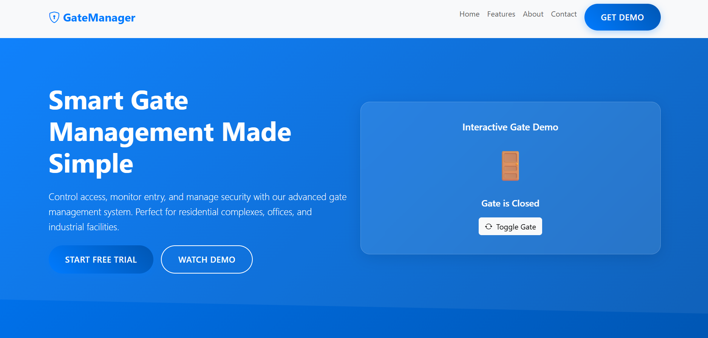

# 🚪 GateManager - Smart Gate Management System

A modern and responsive SaaS landing page for a Smart Gate Management System.  
Built using HTML, CSS, JavaScript and Bootstrap 5.

---

## 🌟 Live Demo
(Add your GitHub Pages link here)

---

## 🚀 Features

- 🔐 Interactive Gate Toggle Demo
- 📊 Animated Statistics Counter
- 📱 Fully Responsive Design
- 🎨 Modern Gradient UI
- 📦 Feature Cards Section
- 📈 Analytics & Dashboard Preview
- 📞 Contact & Demo Request Modal
- ⚡ Smooth Scroll & Scroll Animations
- 🧠 Accessibility Improvements

---

## 🛠️ Technologies Used

- HTML5
- CSS3
- JavaScript (Vanilla JS)
- Bootstrap 5
- Bootstrap Icons

---

## 🎯 Project Purpose

This project demonstrates a smart security system landing page designed for:

- Residential Complexes
- Corporate Offices
- Industrial Facilities
- Smart City Solutions

---

## 📷 Project Screenshot

---

## 💡 Key Highlights

- Animated counters using requestAnimationFrame
- Modal-based demo request form
- Scroll-triggered fade animations using Intersection Observer
- Interactive UI components

---

## 👩‍💻 Developed By

Isha Sharma  
Frontend Developer
